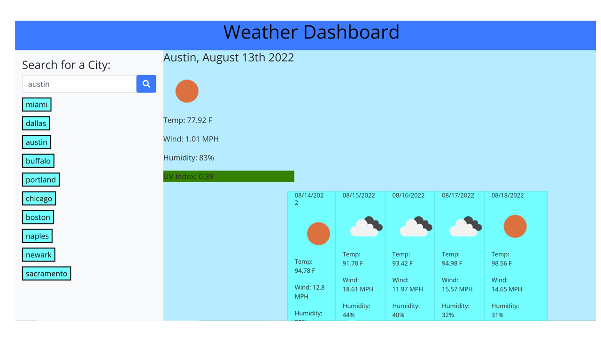

# Forecast_Dashboard
Forecast Dashboard is a weather dashboard that runs in the browser and features dynamically updated HTML and CSS. Using the [OpenWeather One Call API](https://openweathermap.org/api/one-call-api), the application retrieves weather data for cities and displays both the daily forecast and 5-day forecast.

Application deployed at live URL : <a href= "https://monicadolce.github.io/Forecast_Dashboard/">Visit Live Forecast Dashboard</a>

Application GitHub URL : <a href= "https://github.com/monicadolce/Forecast_Dashboard">Visit Monica's GitHub Repository</a> 
